# Unemployment Benefits Rights Assistant 🛡️⚖️

> AI-powered assistant protecting workers' unemployment benefits rights

[](https://azure.microsoft.com/)
[](https://www.python.org/)
[](https://openai.com/)
[](LICENSE)

**[한국어 버전 →](./README_UNEMPLOYMENT_KO.md)**

---

## 📖 Project Overview

This project is an **AI assistant protecting workers' legitimate unemployment benefits rights**. A 24/7 AI legal consultation service defending workers from recent cases of unfair forced resignation (Coupang, London Bagel Museum, etc.), illegal dismissal, and rights violations.

**Key Features:**
- 🚨 Immediate emergency response (forced resignation letters, unfair pressure)
- ⚖️ Identify and alert unfair situations
- 📝 Guide evidence collection (recording, documents, witnesses)
- 🔗 Connect to free legal aid organizations
- 💪 Guide unemployment benefits eligibility
- 📚 Provide basic labor law knowledge

---

## ⚠️ Important Legal Disclaimer

**This service is an AI-powered information tool and does NOT replace professional legal advice.**

- ✅ **General Information**: Unemployment benefits system, basic labor law guidance
- ✅ **Emergency Response Guide**: Immediate actions to take in risky situations
- ✅ **Professional Referral**: Free legal aid organization information

- ❌ **NOT Legal Advice**: Consult professionals for legal judgment on individual cases
- ❌ **NOT Litigation Support**: Legal procedures require attorney/labor specialist consultation

**Emergency Contacts:**
- Ministry of Employment and Labor: **1350** (Weekdays 09:00-18:00)
- Korea Legal Aid Corporation: **132** (Free legal support)

**Always consult with professionals for specific legal matters.**

---

## 🚨 Why This Project is Needed

### Recent Reality in Korea

**Coupang Incident (2024)**:
- Forced "voluntary resignation" on thousands of workers
- Stripped unemployment benefits eligibility
- Workers were unaware of their rights

**London Bagel Museum Case**:
- Avoided unemployment benefits without proper dismissal procedures
- Violated workers' rights

**Numerous SMEs Nationwide**:
- Exploiting complex labor laws
- Disguised as "consensual resignation" or "recommended retirement"
- Depriving workers of legitimate rights

### The Information Gap Problem

| Employer Side | Worker Side |
|--------------|-------------|
| ✅ Professional labor consultant | ❌ No information |
| ✅ Rich legal knowledge | ❌ Difficult to understand complex system |
| ✅ Strategic response | ❌ Panicked immediate response |
| ✅ Time and resources | ❌ Emergency situation |

**Result**: Workers with legitimate rights don't receive unemployment benefits

---

## 💡 The Solution: AI Rights Guardian

### Core Features

#### 1. 🚨 Immediate Emergency Response

```
Situation: "My boss is forcing me to write resignation letter now"

AI Response:
🚨 DO NOT sign anything!

RIGHT NOW:
1. Start recording on smartphone (legal when you're part of conversation)
2. Say "I need time" and leave the room
3. Call Ministry of Employment 1350
4. Photograph all documents received

This is an illegal attempt to deprive unemployment benefits.
```

#### 2. ⚖️ Identify Unfair Situations

**Danger signals AI immediately warns about**:
- "If you resign voluntarily, I'll write you a good recommendation"
- "If you agree to mutual resignation, I'll give you more severance"
- "Just sign here and it's done"
- "Other employees all did this way"
- "No legal problems, don't worry"

→ **Never sign! Need expert consultation immediately!**

#### 3. 📝 Evidence Collection Guide

```
Evidence Collection Checklist:

□ Recording
  - Use smartphone recording app
  - Legal when you're part of the conversation
  - Note date and time

□ Documents
  - All pay stubs
  - Employment contract
  - Email, message backup
  - Company internal documents

□ Witnesses
  - Secure colleague contacts
  - Identify others in same situation

□ Timeline
  - Record events chronologically
  - Who, when, where, what
```

#### 4. 🔗 Free Legal Aid Connection

**Ministry of Employment Call Center**:
- Phone: **1350**
- Hours: Weekdays 09:00-18:00
- Free unemployment benefits, labor law consultation

**Korea Legal Aid Corporation**:
- Phone: **132**
- Free legal consultation and litigation support
- Online: klac.or.kr

**Korean Trade Unions**:
- FKTU: 02-6277-8000
- KCTU: 02-2635-8989

#### 5. 💪 Unemployment Benefits Eligibility Guide

**Basic Eligibility (2024 Standard)**:
- 180+ days of work in 18 months before resignation
- Involuntary separation:
  - ✅ Dismissal (including unfair dismissal)
  - ✅ Recommended retirement
  - ✅ Contract expiration
  - ✅ Company's fault (wage arrears, violation of working conditions)
  - ❌ Simple voluntary resignation

**Benefit Amount**:
- 60% of pre-resignation average wage
- Minimum: ₩63,104 per day
- Maximum: ₩66,000 per day
- Period: 120 to 270 days

---

## 🏗️ Architecture

```mermaid
graph TB
    subgraph "User Layer"
        A[👤 Worker<br/>Web/Mobile Interface]
    end

    subgraph "Azure Cloud"
        B[🌐 Azure Container Apps<br/>Frontend Web]
        C[⚙️ Azure Container Apps<br/>Flask API Backend]
        D[🤖 Azure OpenAI Service<br/>GPT-4]
        E[(📚 Labor Law Database<br/>Employment Insurance Act,<br/>Labor Standards Act,<br/>Court Precedents)]
    end

    subgraph "External Support"
        F[📞 Ministry of Employment<br/>1350]
        G[⚖️ Legal Aid Corporation<br/>132]
    end

    A -->|Consultation Request| B
    B -->|API Call| C
    C -->|Send Prompt| D
    C -->|Query Legal Info| E
    D -->|AI Response| C
    C -->|Consultation Result| B
    B -->|Real-time Guidance| A
    C -.->|Emergency Referral| F
    C -.->|Legal Aid Referral| G

    style A fill:#e1f5ff
    style D fill:#fff4e1
    style E fill:#f0f0f0
    style F fill:#ffe1e1
    style G fill:#ffe1e1
```



**Tech Stack:**
- **Backend:** Python 3.11, Flask
- **AI:** Azure OpenAI Service (GPT-4 recommended)
- **Legal DB:** Employment Insurance Act, Labor Standards Act, Supreme Court precedents
- **Hosting:** Azure Container Apps
- **Deployment:** Azure Developer CLI (azd)
- **Monitoring:** Azure Application Insights (optional)

---

## 📋 Prerequisites

### Required

- [Azure Account](https://azure.microsoft.com/free/)
- [Azure Developer CLI (azd)](https://learn.microsoft.com/azure/developer/azure-developer-cli/install-azd)
- [Git](https://git-scm.com/downloads)
- [Python 3.11+](https://www.python.org/downloads/)

### Optional

- [VS Code](https://code.visualstudio.com/)
- [GitHub Copilot](https://github.com/features/copilot)

---

## 🚀 Quick Start

> **Important**: This project customizes the official Azure AI Chat template.

### Step 0: Understanding the Azure AI Chat Template

First, understand the structure of the template you'll clone:

```
get-started-with-ai-chat/
├── src/
│   ├── api/              ← 🔧 Python Flask backend (we'll modify this)
│   │   ├── app.py        ← Main API file (complete replacement)
│   │   └── ...
│   ├── frontend/         ← ✅ TypeScript UI (use as-is)
│   └── ...
├── infra/                ← Azure resource definitions (Bicep)
├── docs/                 ← Official documentation
├── azure.yaml            ← Azure Developer CLI config
└── pyproject.toml        ← Python dependencies
```

**Key Points**:
- ✅ **Backend (`src/api/`)**: Completely replace with unemployment assistant logic
- ✅ **Frontend (`src/frontend/`)**: Use template as-is (provides chat UI)
- ✅ **Infrastructure (`infra/`)**: Automatically creates Azure resources

---

### Step 1: Clone Repository

```bash
# Clone Azure AI Chat template
git clone https://github.com/Azure-Samples/get-started-with-ai-chat.git unemployment-assistant
cd unemployment-assistant

# Verify current location
pwd
# Output example: /Users/username/unemployment-assistant
```

**Or use the complete project** (to be updated after deployment):
```bash
# git clone https://github.com/Power-Platform-Users-Korea/ImagineCup.git
# cd ImagineCup/2026-imagine-cup/unemployment-assistant
```

---

### Step 2: Create Custom Directories

Create these folders in the **project root**:

```bash
# Verify you're in unemployment-assistant/
pwd

# Create custom data folders
mkdir -p prompts        # System prompts storage
mkdir -p data           # Labor law database storage
mkdir -p logs           # Log files (optional)
```

**Verify folder structure**:
```bash
ls -la
# Should see:
# drwxr-xr-x  prompts/
# drwxr-xr-x  data/
# drwxr-xr-x  logs/
# drwxr-xr-x  src/
# -rw-r--r--  azure.yaml
```

### Step 3: Create System Prompt

Create `prompts/unemployment_assistant.md`:

```markdown
# Unemployment Benefits Rights Guardian System Prompt

You are "Rights Guardian" - an AI assistant protecting workers' unemployment benefits rights.

## Core Role

Help workers avoid unfair treatment and protect their unemployment benefits rights.

## Main Support Areas

1. **Unemployment Benefits Eligibility Guidance**
   - Difference between voluntary resignation vs recommended retirement vs dismissal
   - Check eligibility requirements
   - Calculate benefit amount

2. **Identify Unfair Situations**
   - Recognize "voluntary resignation inducement" tactics
   - Respond to "mutual resignation" pressure
   - Judge illegal dismissal

3. **Evidence Collection Guidance**
   - Recording methods
   - Document preservation
   - Witness securing

4. **Response Procedure Guidance**
   - Employment center reporting
   - Labor office complaint
   - Free legal aid

## Response Principles

### 1. Clear and Firm
❌ "Maybe...", "You could..."
✅ "This is illegal", "You have rights"

### 2. Immediate Action Guidance
Clearly present what to do RIGHT NOW

### 3. Simplify Legal Terms
- "Involuntary separation" → "Company made you quit"
- "Recommended retirement" → "Company suggested you quit (benefits eligible)"

### 4. Immediate Warning on Danger Signals

These situations are unfair unemployment benefits deprivation attempts:
- "If you resign voluntarily, I'll write a recommendation"
- "If we agree on mutual resignation, I'll give more severance"
- "Just sign here and it's done"

→ Never sign! Need expert consultation immediately!

## Emergency Response Manual

### Situation 1: "Write resignation letter now" pressure

```
Immediate actions:
1. 🎙️ Start recording
2. 🗣️ "I need time"
3. 🚶 Leave the room
4. 📞 Call 1350
5. 📸 Photograph documents
```

### Situation 2: Already wrote resignation letter

```
Not too late!

1. Send "resignation letter withdrawal" via certified mail
2. Complaint to Ministry of Employment
3. File for relief with Labor Relations Commission
```

## Free Legal Support

- Ministry of Employment: **1350**
- Korea Legal Aid Corporation: **132**
- FKTU: 02-6277-8000
- KCTU: 02-2635-8989

## Important Legal Basis

### Employment Insurance Act Article 58
Involuntarily separated persons have right to unemployment benefits.

### Labor Standards Act Article 23
Cannot dismiss without justifiable reason.

### Criminal Act Article 324 (Coercion)
Punishable if forcing action against will through assault or threat

## Acknowledge Limitations

**Important: I am an AI consultation assistant**

✅ Provide general information
✅ Emergency response guidance
✅ Identify danger signals
✅ Connect to professionals

❌ Legal advice (only labor attorneys/specialists can)
❌ Final judgment on individual cases
❌ Litigation representation

**For complex situations, always consult with professionals!**

---

Your first step to protecting your rights, Rights Guardian is with you.
```

### Step 4: Add Labor Law Data

Create `data/labor_law_info.md` with:
- Unemployment benefits eligibility criteria (2024 standard)
- Benefit calculation methods
- Application procedures
- Unfair tactics identification
- Evidence collection methods
- Response procedures
- Free legal aid organizations
- Important legal basis and precedents

(See Korean version for detailed content)

### Step 5: Modify Backend Code

**⚠️ Important**: You'll completely replace the template's backend with unemployment assistant logic.

**Backup the original first** (optional, for reference):
```bash
cp src/api/app.py src/api/app.py.backup
```

**Replace** `src/api/app.py` with unemployment assistant backend:

```python
import os
from pathlib import Path
from openai import AzureOpenAI
from flask import Flask, request, jsonify
import logging

app = Flask(__name__)
logging.basicConfig(level=logging.INFO)

client = AzureOpenAI(
    api_key=os.getenv("AZURE_OPENAI_API_KEY"),
    api_version="2024-02-15-preview",
    azure_endpoint=os.getenv("AZURE_OPENAI_ENDPOINT")
)

def load_custom_prompts():
    """Load custom system prompt and labor law data"""
    try:
        project_root = Path(__file__).parent.parent.parent
        
        prompt_path = project_root / "prompts" / "unemployment_assistant.md"
        with open(prompt_path, "r", encoding="utf-8") as f:
            system_prompt = f.read()
        
        data_path = project_root / "data" / "labor_law_info.md"
        with open(data_path, "r", encoding="utf-8") as f:
            labor_law_data = f.read()
        
        full_prompt = f"{system_prompt}\n\n# Labor Law Information\n\n{labor_law_data}"
        
        logging.info("✅ Rights Guardian prompts loaded successfully")
        return full_prompt
    
    except Exception as e:
        logging.error(f"❌ Failed to load prompts: {e}")
        return "You are an AI consultant helping workers' rights."

SYSTEM_PROMPT = load_custom_prompts()

@app.route("/chat", methods=["POST"])
def chat():
    """Unemployment benefits rights consultation"""
    try:
        user_message = request.json.get("message", "")
        
        if not user_message:
            return jsonify({"error": "No message provided"}), 400
        
        logging.info(f"📩 Consultation request: {user_message[:50]}...")
        
        response = client.chat.completions.create(
            model=os.getenv("AZURE_OPENAI_DEPLOYMENT_NAME", "gpt-4"),
            messages=[
                {"role": "system", "content": SYSTEM_PROMPT},
                {"role": "user", "content": user_message}
            ],
            temperature=0.7,
            max_tokens=1000
        )
        
        assistant_reply = response.choices[0].message.content
        logging.info(f"✅ Consultation response generated")
        
        return jsonify({
            "response": assistant_reply,
            "model": response.model,
            "usage": {
                "prompt_tokens": response.usage.prompt_tokens,
                "completion_tokens": response.usage.completion_tokens,
                "total_tokens": response.usage.total_tokens
            }
        })
    
    except Exception as e:
        logging.error(f"❌ Error: {e}")
        return jsonify({
            "error": "Sorry, an error occurred.",
            "emergency_contact": "Call Ministry of Employment 1350 immediately"
        }), 500

@app.route("/health", methods=["GET"])
def health():
    return jsonify({"status": "healthy", "service": "Rights Guardian"})

if __name__ == "__main__":
    app.run(host="0.0.0.0", port=8000, debug=False)
```

**Key Changes**:
- ✅ Loads custom prompts from `prompts/unemployment_assistant.md`
- ✅ Loads labor law data from `data/labor_law_info.md`
- ✅ Uses Flask `/chat` endpoint compatible with template frontend
- ✅ Includes `/health` endpoint for monitoring

---

### Step 6: Environment Variables

The Azure deployment automatically configures these variables. Understanding them helps with troubleshooting:

| Variable | Description | Set By |
|----------|-------------|--------|
| `AZURE_OPENAI_API_KEY` | OpenAI authentication key | `azd up` |
| `AZURE_OPENAI_ENDPOINT` | OpenAI service URL | `azd up` |
| `AZURE_OPENAI_DEPLOYMENT_NAME` | GPT model name | `azure.yaml` (default: gpt-4) |

**No manual configuration needed** - Azure Developer CLI handles this during deployment.

---

### Step 7: Azure Deployment

#### 7.1 Initialize Azure Developer CLI

```bash
azd init
```

**Interactive prompts**:
- Environment name: `unemployment-assistant` (or any name you prefer)
- This creates `.azure/` folder with configuration

#### 7.2 Login to Azure

```bash
azd auth login
```

This opens browser for Azure authentication.

**Verify login**:
```bash
az account show
```

#### 7.3 Deploy to Azure

```bash
azd up --location koreacentral
```

**Recommended regions for Korea**:
- `koreacentral` - Korea Central (Seoul)
- `koreasouth` - Korea South (Busan)
- `japaneast` - Japan East (Tokyo, if Korea full)

**Deployment process** (10-15 minutes total):
1. ⏳ **Azure resources creation** (5-7 min)
   - Azure OpenAI Service
   - Container Apps Environment
   - Container Registry
   - Application Insights (monitoring)

2. 🔨 **Docker image build** (3-5 min)
   - Backend containerization
   - Frontend containerization

3. 🚀 **Container deployment** (2-3 min)
   - Push to Container Registry
   - Deploy to Container Apps

**Successful output**:
```
Deploying services (azd deploy)

  (✓) Done: Deploying service api
  - Endpoint: https://api.xxx.koreacentral.azurecontainerapps.io

  (✓) Done: Deploying service web
  - Endpoint: https://web.xxx.koreacentral.azurecontainerapps.io

SUCCESS: Your application was provisioned and deployed to Azure in 12 minutes 34 seconds.
```

---

### Step 8: Deployment Verification & Testing

#### 8.1 Check Deployment URLs

```bash
azd show
```

**Look for**:
- `web` service URL - This is your **main application URL**
- `api` service URL - Backend API endpoint

#### 8.2 Open Web UI

Visit the `web` URL in your browser:
```
https://web-xxx.koreacentral.azurecontainerapps.io
```

**You should see**:
- Chat interface with message input
- Ready to send messages

#### 8.3 Test API Directly (Optional)

```bash
# Replace with your actual API URL
curl -X POST https://api-xxx.koreacentral.azurecontainerapps.io/chat \
  -H "Content-Type: application/json" \
  -d '{"message": "Can I get unemployment benefits if I worked for 8 months?"}'
```

**Expected response**:
```json
{
  "response": "✅ Yes! You meet the basic eligibility...",
  "model": "gpt-4",
  "usage": {
    "prompt_tokens": 1234,
    "completion_tokens": 567,
    "total_tokens": 1801
  }
}
```

#### 8.4 Health Check

```bash
curl https://api-xxx.koreacentral.azurecontainerapps.io/health
```

**Expected**:
```json
{"status": "healthy", "service": "Rights Guardian"}
```

---

## 🧪 Test Scenarios

### Scenario 1: Emergency Situation

**Input**:
```
My boss is forcing me to write a resignation letter right now.
Says they'll discipline me if I don't.
```

**Expected Response**:
- 🚨 Never sign warning
- Immediate action guide (recording, call 1350)
- Coercion law basis presentation

### Scenario 2: Mutual Resignation Offer

**Input**:
```
Company says they'll give me more severance if I agree to mutual resignation.
Should I do it?
```

**Expected Response**:
- ⚠️ Danger signal warning
- Need to compare unemployment benefits vs additional severance
- Recommend expert consultation (132)

### Scenario 3: Unemployment Benefits Eligibility Check

**Input**:
```
I worked for 1 year and 3 months, and the company is
reducing staff due to business difficulties. Can I get unemployment benefits?
```

**Expected Response**:
- ✅ Confirm eligibility
- Guide required documents
- Explain application procedure step-by-step

---

## 📊 Projected Social Impact

> **Note**: Figures below are estimates based on 2024 media reports and government statistics.

### If Applied to Coupang Case (Estimated)

**Actual Situation** (2024):
- Workers Affected: Approximately 1,000+ (based on media reports)
- Estimated unemployment benefits not received: ~₩500,000,000+

**If AI existed** (Expected Effect):
- Immediate unfairness identification and alert
- Real-time evidence collection guidance
- Collective response organization support
- Improved unemployment benefits claim success rate

### Nationwide Projected Impact

**Annual Estimate**:
- Unfair resignation coercion victims: ~10,000+ (Ministry of Employment estimate)
- Total unemployment benefits not received: ~₩5,000,000,000
- **Recoverable with AI: ~7,000+ workers (assuming 70% success rate)**

---

## 📊 Cost Analysis

### Traditional Method vs AI Assistant

| Item | Traditional | AI Assistant |
|------|-------------|--------------|
| **Labor Attorney** | ₩200,000-500,000 | Free |
| **Wait Time** | Days to weeks | Immediate |
| **Accessibility** | Phone/visit required | Anytime, anywhere |
| **Emergency Response** | Difficult | 24/7 real-time |
| **Evidence Guide** | After-the-fact | Preventive |
| **Monthly Operation** | - | ₩30,000-50,000 |

### ROI (Social Return on Investment)

> **Note**: ROI is based on total protected unemployment benefits, representing social value rather than direct revenue.

**With ₩50,000/month operating cost** (Estimated):
- Can consult 100 workers (based on Azure OpenAI usage)
- Average unemployment benefit: ₩1,500,000 x 120 days = ~₩180,000,000
- **Social ROI: 360,000%** (Total protected benefits / Operating cost)

*Actual operating costs may vary depending on usage.*

---

## 🔧 Troubleshooting

### Deployment Errors

#### Issue 1: "Subscription not found" or "No subscriptions found"

**Cause**: Not logged in or wrong subscription selected

**Solution**:
```bash
# Login again
az login

# List available subscriptions
az account list --output table

# Set correct subscription
az account set --subscription "Your Subscription ID"

# Verify
az account show
```

#### Issue 2: "Location not available" or "OpenAI quota exceeded"

**Cause**: Selected Azure region doesn't support OpenAI or quota full

**Solution**:
```bash
# Try different region
azd up --location japaneast    # Tokyo
azd up --location eastus        # US East
azd up --location westeurope    # West Europe

# Or request quota increase:
# Azure Portal → Quotas → Request increase
```

#### Issue 3: Container build fails - "Failed to build image"

**Cause**: Docker/build environment issues

**Solution**:
```bash
# Check Docker is running (if using local build)
docker --version

# Clear azd cache and retry
azd down --purge
azd up --location koreacentral

# Check build logs
azd deploy --debug
```

#### Issue 4: Deployment succeeds but app doesn't start

**Cause**: Missing files or environment variables

**Solution**:
```bash
# Verify required files exist
ls -la prompts/unemployment_assistant.md
ls -la data/labor_law_info.md

# Check container logs
az containerapp logs show \
  --name api \
  --resource-group <resource-group-name> \
  --follow

# Look for file loading errors in logs
```

---

### Runtime Errors

#### Issue 5: "404 Not Found" on /chat endpoint

**Cause**: Frontend/backend mismatch or routing issue

**Solution**:
```bash
# Test API directly
curl https://api-xxx.azurecontainerapps.io/health

# If health works but chat doesn't, check backend code
# Verify route is defined: @app.route("/chat", methods=["POST"])
```

#### Issue 6: "Failed to load prompts" error in logs

**Cause**: Prompt files not found in container

**Solution**:
```bash
# Verify files exist in project root (not src/api/)
unemployment-assistant/
├── prompts/unemployment_assistant.md  ← Must be here
├── data/labor_law_info.md             ← Must be here
└── src/api/app.py

# Redeploy after fixing file locations
azd deploy
```

#### Issue 7: "OpenAI API key not found" or authentication errors

**Cause**: Environment variables not set

**Solution**:
```bash
# Check environment variables in Container App
az containerapp show \
  --name api \
  --resource-group <rg-name> \
  --query "properties.template.containers[0].env"

# If missing, redeploy:
azd down
azd up --location koreacentral
```

#### Issue 8: Slow responses or timeout

**Cause**: GPT-4 can be slow, or insufficient container resources

**Solution**:
1. **Use GPT-3.5-turbo** for faster responses:
   ```python
   # In src/api/app.py
   model=os.getenv("AZURE_OPENAI_DEPLOYMENT_NAME", "gpt-35-turbo")
   ```

2. **Increase timeout**:
   ```python
   # Add timeout parameter
   response = client.chat.completions.create(
       model="gpt-4",
       messages=[...],
       timeout=30  # seconds
   )
   ```

3. **Scale up Container App**:
   ```bash
   az containerapp update \
     --name api \
     --resource-group <rg-name> \
     --cpu 1.0 --memory 2.0Gi
   ```

---

### AI Response Quality Issues

#### Issue 9: AI responds too formally

**Solution**: Adjust prompt tone in `prompts/unemployment_assistant.md`

```markdown
## Tone and Manner
- Firm but warm
- Use "you" address (not "client" or "worker")
- More conversational, less legal jargon
- Include empathy and encouragement

Example:
❌ "The individual should proceed with the following steps..."
✅ "Here's what you should do right now..."
```

#### Issue 10: AI mistaken for legal advice

**Solution**: Strengthen limitations in system prompt

```markdown
⚠️ IMPORTANT: I am an AI consultation assistant

✅ What I do:
- Provide general information about labor laws
- Guide immediate actions in emergencies
- Connect you to professional help

❌ What I CANNOT do:
- Give legal advice on your specific case
- Replace labor attorney/specialist consultation
- Represent you in legal proceedings

For specific legal advice: Consult professionals
- Emergency: Ministry of Employment 1350
- Free Legal Aid: Korea Legal Aid Corporation 132
```

---

## 💰 Resource Management & Cost Optimization

### Monthly Cost Estimates (Korea Central Region)

| Resource | Tier | Estimated Monthly Cost |
|----------|------|----------------------|
| **Azure OpenAI (GPT-4)** | Pay-as-you-go | ₩20,000 - 40,000 |
| **Container Apps** | Consumption | ₩5,000 - 10,000 |
| **Container Registry** | Basic | ₩6,000 |
| **Application Insights** | Basic (5GB free) | ₩0 - 5,000 |
| **Total** | - | **₩30,000 - 60,000** |

**Notes**:
- GPT-4 costs based on ~100 consultations/month (avg 1500 tokens each)
- Container Apps costs with auto-scaling (0-2 instances)
- Actual costs vary based on usage
- First-time users may qualify for Azure free credits

### Cost Optimization Tips

#### 1. Use GPT-3.5-Turbo Instead of GPT-4

**Savings**: ~70% reduction in AI costs

```python
# In src/api/app.py
model=os.getenv("AZURE_OPENAI_DEPLOYMENT_NAME", "gpt-35-turbo")
```

**Trade-off**: Slightly lower response quality, but sufficient for most consultations

#### 2. Enable Container Apps Auto-Scaling

**Default behavior**: Scales to 0 when idle (no cost)

Verify in `azure.yaml`:
```yaml
services:
  api:
    scaling:
      minReplicas: 0  # Scales down to 0 when no traffic
      maxReplicas: 2
```

#### 3. Set Up Budget Alerts

```bash
# Azure Portal → Cost Management → Budgets
# Create alert for when spending exceeds ₩50,000
```

---

### Resource Cleanup

#### Temporary Shutdown (Keep Resources)

**Scenario**: Pause project but keep data for later

```bash
# Scale down to 0 instances (no Container Apps charges)
az containerapp update \
  --name api \
  --resource-group <rg-name> \
  --min-replicas 0 \
  --max-replicas 0

# OpenAI service has no idle charges (pay per use)
```

**Resume later**:
```bash
# Restore auto-scaling
az containerapp update \
  --name api \
  --resource-group <rg-name> \
  --min-replicas 0 \
  --max-replicas 2
```

#### Complete Cleanup (Delete All Resources)

**WARNING**: This deletes everything permanently!

```bash
# Delete entire resource group and all resources
azd down --purge

# Confirm when prompted (type 'y')
```

**What gets deleted**:
- ✅ Azure OpenAI Service
- ✅ Container Apps
- ✅ Container Registry
- ✅ Application Insights
- ✅ All configuration and data

**Cost after cleanup**: ₩0

---

### Redeployment After Cleanup

If you deleted everything and want to redeploy:

```bash
# Same as initial deployment
azd up --location koreacentral
```

**Time**: ~10-15 minutes (same as first deployment)

---

## 📊 Monitoring & Logging

### View Application Logs

#### Real-time Log Streaming

```bash
# API backend logs
az containerapp logs show \
  --name api \
  --resource-group <resource-group-name> \
  --follow

# Frontend logs
az containerapp logs show \
  --name web \
  --resource-group <resource-group-name> \
  --follow
```

**Look for**:
- ✅ `Rights Guardian prompts loaded successfully` - Backend started correctly
- ✅ `Consultation request: ...` - Incoming requests
- ❌ `Failed to load prompts` - File loading error
- ❌ `OpenAI API key not found` - Environment variable issue

#### Recent Logs (Last 100 Lines)

```bash
az containerapp logs show \
  --name api \
  --resource-group <rg-name> \
  --tail 100
```

---

### Application Insights (Advanced Monitoring)

#### Access Application Insights

1. Go to **Azure Portal** → **Resource Groups** → Your resource group
2. Click **Application Insights** resource
3. Navigate to:
   - **Live Metrics**: Real-time traffic and performance
   - **Failures**: Error tracking
   - **Performance**: Response times
   - **Logs**: Query all telemetry data

#### Useful Queries

**Find slow requests** (over 3 seconds):
```kusto
requests
| where duration > 3000
| project timestamp, name, duration, resultCode
| order by duration desc
```

**Count consultations per day**:
```kusto
requests
| where name == "POST /chat"
| summarize count() by bin(timestamp, 1d)
| render timechart
```

**Error rate**:
```kusto
requests
| summarize Total=count(), Errors=countif(success == false)
| extend ErrorRate = (Errors * 100.0) / Total
```

---

### Health Monitoring

#### Manual Health Check

```bash
curl https://api-xxx.koreacentral.azurecontainerapps.io/health
```

**Expected**:
```json
{"status": "healthy", "service": "Rights Guardian"}
```

#### Set Up Automated Health Alerts (Optional)

**Azure Portal** → **Container App** → **Alerts** → **Create Alert Rule**:
- Metric: HTTP response code 5xx
- Threshold: > 5 errors in 5 minutes
- Action: Send email notification

---

## 🤝 Contributing

### For Labor Organizations

1. **Update Legal Information**: Provide latest precedents, law amendments
2. **Share Cases**: Share actual unfair cases (anonymized)
3. **Validation**: Review legal accuracy of AI responses

### For Developers

1. **Add Features**:
   - Multilingual support (foreign workers)
   - Voice recognition (emergency situations)
   - Automatic evidence organization

2. **Optimization**:
   - Improve response speed
   - Reduce costs

---

## 📚 Resources

### Official Documents
- [Employment Insurance Act](https://www.law.go.kr/)
- [Labor Standards Act](https://www.law.go.kr/)
- [Ministry of Employment and Labor](https://www.moel.go.kr/)
- [Korea Workers' Compensation & Welfare Service](https://www.kcomwel.or.kr/)

### Support Organizations
- [Korea Legal Aid Corporation](https://www.klac.or.kr/)
- [FKTU](http://www.fktu.or.kr/)
- [KCTU](http://www.nodong.org/)

---

## 📄 License

MIT License

---

## 👥 Authors & Acknowledgments

**Motivation**: Recent workers' rights violations (Coupang, London Bagel Museum, etc.)

**Special Thanks**:
- All activists fighting for workers' rights
- Attorneys and labor specialists providing legal aid
- Workers standing up against unfair treatment

---

## 📞 Contact

- **GitHub**: [Power-Platform-Users-Korea/ImagineCup](https://github.com/Power-Platform-Users-Korea/ImagineCup/issues)
- **Emergency Consultation**: Ministry of Employment 1350
- **Free Legal Aid**: Korea Legal Aid Corporation 132

---

## 🎯 Imagine Cup 2026 - Financial Services Category

**Category**: Financial Services

**Challenge**: Economic inequality through unemployment benefits deprivation

Vulnerable workers are unable to receive legitimate unemployment benefits due to information gaps in complex labor laws. This is a financial services accessibility issue that threatens individual economic stability and financial security.

**Innovative Solution**: Democratizing financial rights protection through AI

- Transform complex labor laws into 24/7 accessible real-time consultation service
- Personalized rights guidance using Azure OpenAI
- Enhance financial security by resolving information asymmetry

**Social Impact**: Protecting workers' economic safety net

- Support approximately 10,000+ workers annually
- Protect unemployment benefits worth approximately ₩5,000,000,000
- Improve financial stability for vulnerable populations

**Tech Stack**: Azure OpenAI, Azure Container Apps, Python/Flask

---

<div align="center">

**Made with ❤️ to protect workers' rights**

**Powered by Azure AI | Built for Social Justice**

⭐ **Star this repo if you believe in workers' rights!** ⭐

[⬆ Back to Top](#unemployment-benefits-rights-assistant-️️)

</div>
